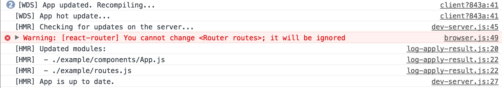
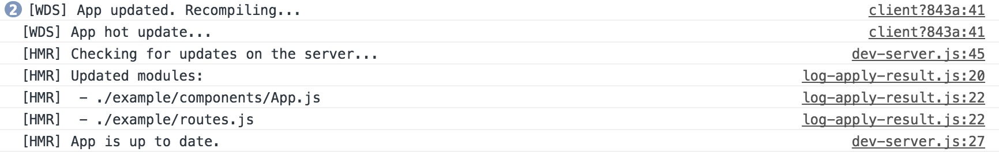

## 前言

*因为准备开源几个在之前[项目](https://github.com/ShinyLeee/meteor-album-app)中经常使用到的React组件的缘故，这两天开始了学习如何使用Babel以及Webpack搭建一个方便的开发环境。*

*一开始的时候其实本来是想使用[Yeoman](https://github.com/yeoman/yeoman)的一些脚手架来快速搭建的，在其中我尝试了[React-CDK](https://github.com/kadirahq/react-cdk)，它是基于[React-Storybook](https://github.com/storybooks/react-storybook)开发环境的。经过尝试这确实是一个非常方便的 **UI组件开发环境** 。但因为我所想开源的是面向移动端功能型的组件，另外在React-Storybook的开发环境中嵌入一个移动端模拟器可能比较麻烦。最终也为了系统点地了解如何使用Babel和Webpack，以方便理解各个开源项目的构建方式，就开始了从零开始的开发环境搭建。*

---

## 搭建步骤

**1. 搭建目录结构**

以下是初步搭建后的目录结构:

```
├── dist                       // 组件输出文件夹
├── example
│   ├── components
│   │   ├── App.js
│   ├── js                    // 示例输出文件夹
│   │   ├── bundle.min.js
│   ├── pages                 // 单页页面组件
│   │   ├── Home.js
│   │   └── NotFound.js
│   ├── index.js              // 示例入口文件
│   ├── index.html     
│   ├── Root.js               // 根组件
│   └── routes.js             // React-Router路由配置
├── src                      
│   └── index.js              // 组件源码
├── test                      
│   └── index.js              // 测试文件
├── .babelrc
├── .eslintignore
├── .eslintrc
├── .gitignore
├── .npmignore
├── LICENSE
├── README.md
├── package.json
├── webpack.config.js
├── webpack.prod.config.js
└── yarn.lock
```

> 一般开源的React组件项目结构一般都跟上面的大同小异，其中文件夹的命名可根据自己的喜好所定。

**2. 安装相关NPM模块**

以下是最终开发环境下安装的所有依赖:

其中大部分依赖是必不可少的，当然也有些可自行选择，比如下面我并没有选择安装babel-polyfill或者babel-runtime，因为预计开发该组件用不到Promise等特性，还有测试框架也可以选择Jest或其他。

```
  "devDependencies": {
    "babel-cli": "^6.23.0",
    "babel-core": "^6.23.1",
    "babel-eslint": "^7.1.1",
    "babel-loader": "^6.4.0",
    "babel-preset-es2015": "^6.24.0",
    "babel-preset-react": "^6.23.0",
    "chai": "^3.5.0",
    "enzyme": "^2.7.1",
    "eslint": "^3.17.1",
    "eslint-config-airbnb": "^14.1.0",
    "eslint-plugin-import": "^2.2.0",
    "eslint-plugin-jsx-a11y": "^4.0.0",
    "eslint-plugin-react": "^6.10.0",
    "mocha": "^3.2.0",
    "react": "^15.4.2",
    "react-dom": "^15.4.2",
    "react-hot-loader": "3.0.0-beta.6",
    "react-router": "2.8.1",
    "webpack": "^2.2.1",
    "webpack-dev-server": "^2.4.1"
  },
```

> 虽说Babel在版本6以后刚入门时会不太容易使用，但是它的可配置性确实是更加适应前端的发展。ESLint和Webpack也是如此，其实用过以后发现了解了其中一个的大致配置方法，其余工具的配置也是相差不大。

**3. 配置ESLint**

相比来说ESLint的配置是比较简单的了: [[Configuring ESLint]](http://eslint.cn/docs/user-guide/configuring)

**.eslintrc**

```
{
  "parser": "babel-eslint",
  "extends": "airbnb",
  "env": {
    "browser": true,
    "mocha": true
  },
  "globals": {
    "chai": true
  },
  "rules": {
    "no-underscore-dangle": 0,
    "import/no-extraneous-dependencies": 0,
    "react/jsx-filename-extension": 0,
    "react/forbid-prop-types": 0
  }
}
```

> 通过以上配置，再配合上VSCode的ESLint插件，在项目中就可以非常舒服地进行一系列规范的编码工作了，当然有些不太喜欢的规则还是需要通过rules或者注释解除掉的。

**4. 配置Babel并转码**

在.babelrc文件中将安装的转码规则写入，并在package.json中为npm script添加一条转码的命令行语句build就可以了。

**.babelrc**

```
{
  "presets": ["es2015", "react"]
}
```

**package.json**

```
  "scripts": {
    "start": "webpack-dev-server",
    "lint": "eslint -c .eslintrc src/",
    "lintfix": "eslint src/ --fix",
    "build": "babel src/ --out-dir dist/",
    "build-demo": "NODE_ENV=production webpack --config webpack.prod.config.js"
  },
```

**5. 配置Webpack**

如果只是写一个组件的话其实用不到Webpack，我们只需要把组件用Babel转码为兼容代码就可以发布了。不过一个demo还是非常必要的，因为开发环境是非常需要一个demo来进行组件的调试的。

Webpack的配置相对来说比较复杂，但是真的非常感谢[Webpack2的文档](https://webpack.js.org/configuration/)非常地齐全。

**.webpack.config.js**

```
/* eslint-disable */
var path = require('path');
var webpack = require('webpack');

module.exports = {
  entry: './example/index.js',             // 入口文件
  output: {                                // 输出配置
    filename: 'bundle.min.js',
    path: path.resolve(__dirname, 'example/js'),
    publicPath: '/js'
  },
  module: {
    loaders: [              // 使用babel以给定规则转码
      {
        test: /\.js$/,
        loader: 'babel-loader',
        exclude: /node_modules/,
        options: {
          presets: ['es2015', 'react']
        }
      }
    ]
  },
  resolve: {
    extensions: ['.js', '.jsx']      // import无须添加后缀
  },
  devServer: {                       // 配置开发服务器
    contentBase: path.resolve(__dirname, 'example'),
    port: 3000,
    publicPath: '/js'
  },
  devtool: 'inline-source-map'
};
```

> 开发环境下的Webpack配置也是差不多，我在其中配置了DefinePlugin和UglifyJsPlugin，其余一些常用的[Webpack内置插件](https://github.com/webpack/docs/wiki/list-of-plugins)可以根据自己的需要选用。

**6. 实现React组件热加载**

经过前五步，其实已经可以在命令行里输入yarn start开始常规的开发了，但是有更加方便的热加载工具[React-Hot-Loader](https://github.com/gaearon/react-hot-loader)，有什么理由不用呢？

在这里我选择安装目前的最新版本[v3.0.0-beta.6]，它的配置会比之前的版本方便很多。它的配置可以查看一些[Starter-Kit](https://github.com/gaearon/react-hot-loader/tree/master/docs#starter-kits)，也可以阅读Webpack的[指南](https://webpack.js.org/guides/hmr-react/)。

### 以下是我的步骤：

- **修改.babelrc**

添加react-hot-loader/babel插件

```
{
  "presets": [
    ["es2015", { "modules": false } ],
    // webpack understands the native import syntax, and uses it for tree shaking

    "react"
    // Transpile React components to JavaScript
  ],
  "plugins": [
    "react-hot-loader/babel"
    // Enables React code to work with HMR.
  ]
}
```

- **修改.webpack.config.js**

```
/* eslint-disable */
var path = require('path');
var webpack = require('webpack');

module.exports = {
  entry: [
    'react-hot-loader/patch',
    // activate HMR for React

    'webpack-dev-server/client?http://localhost:3000',
    // bundle the client for webpack-dev-server
    // and connect to the provided endpoint

    'webpack/hot/only-dev-server',
    // bundle the client for hot reloading
    // only- means to only hot reload for successful updates

    './example/index.js'
  ],
  output: {
    filename: 'bundle.min.js',
    path: path.resolve(__dirname, 'example/js'),
    publicPath: '/js'
  },
  module: {
    loaders: [
      {
        test: /\.js$/,
        loader: 'babel-loader',
        exclude: /node_modules/,
        options: {
          presets: ['es2015', 'react']
        }
      }
    ]
  },
  resolve: {
    extensions: ['.js', '.jsx']
  },
  devServer: {
    hot: true,
    contentBase: path.resolve(__dirname, 'example'),
    port: 3000,
    publicPath: '/js'
  },
  plugins: [
    new webpack.HotModuleReplacementPlugin(),
    // enable HMR globally

    new webpack.NamedModulesPlugin(),
    // 在console中打印出具体被修改的模块名
  ],
  devtool: 'inline-source-map'
};
```

- **修改example/index.js**

```
import React from 'react';
import ReactDOM from 'react-dom';
import { AppContainer } from 'react-hot-loader';

import Root from './Root';
import routes from './routes';

const render = (AppRoute) => {
  ReactDOM.render(
    <AppContainer>
      <Root routes={AppRoute} />
    </AppContainer>,
    document.getElementById('app'),
  );
};

render(routes);

// Hot Module Replacement API
if (module.hot) {
  module.hot.accept('./routes', () => {
    const newRoutes = require('./routes').default; // eslint-disable-line global-require
    render(newRoutes);
  });
}
```

- **修改example/Root.js**
```
/* eslint-disable react/prefer-stateless-function */
import React, { Component, PropTypes } from 'react';
import { Router, hashHistory } from 'react-router';

export default class Root extends Component {
  render() {
    return (
      <Router history={hashHistory}>
        {this.props.routes()}
      </Router>
    );
  }
}

Root.propTypes = {
  routes: PropTypes.func.isRequired,
};
```

- **修改example/routes.js**

```
import React from 'react';
import { IndexRoute, Route } from 'react-router';

import App from './components/App';
import Home from './pages/Home';
import NotFound from './pages/NotFound';

const routes = () => (
  <Route path="/" component={App}>
    <IndexRoute component={Home} />
    <Route path="*" component={NotFound} />
  </Route>
);

export default routes;
```

最后测试修改路由里的App组件可以发现，我们已经成功实现了热加载，但是仍然存在以下问题，React-Router会报错**You cannot change... it will be ignored**。

<figure>
	
	<figcaption>React-Router报错</figcaption>
</figure>

报错的原因是因为我们通过热加载Re render了Router组件而传递进去的routes属性却没有变化，具体可以看[Router源码](https://github.com/ReactTraining/react-router/blob/6eeb7ad358f987520f5b519e48bdd31f725cbade/modules/Router.js#L117)，虽然这个问题对开发影响不大，但是反复的报错会让人很不舒服，因此社区也给出了许多[解决方案](https://github.com/ReactTraining/react-router/issues/2704)。

而我所选择的是为Root组件添加key属性，当需要热加载时reconcile出一个新的Root实例即可。
`<Root key={module.hot ? Math.random() : undefined} routes={AppRoute} />`

现在我们再试着修改一次App组件，可以发现问题已经解决。

<figure>
	
	<figcaption>控制台信息</figcaption>
</figure>

## 总结

这一系列的配置过程下来还是比较麻烦的，而开源其他不同类型的项目配置的过程又有所不同，因此如果不是出于学习Webpack的缘故的话还是直接使用Yeoman找一些成熟的generator比较方便。

## 参考链接

[Babel入门教材 - 阮一峰](http://www.ruanyifeng.com/blog/2016/01/babel.html)

[Webpack官方文档](https://webpack.js.org/configuration)

[React Hot Loader 3 beta 升级指南 - Sebastian Blade](https://sebastianblade.com/react-hot-loader-3-beta-upgrade-guide/)
